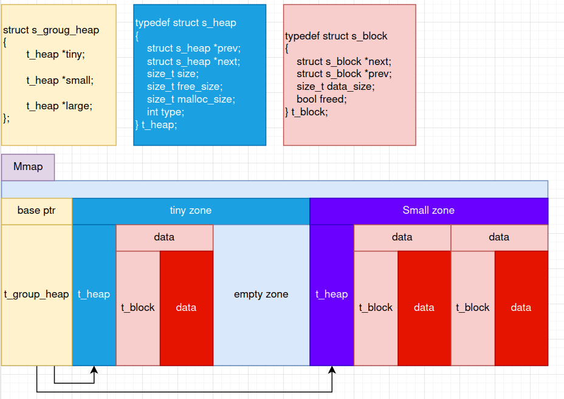

<h1 align="center" >Recode Malloc</h1>

<h3 align="center">My Own malloc with mmap and munmap</h3>

## usage

` make && make test && ./run.sh ./mallocTest`

---

<h2 align="center">Approach</h2>

## First Step : functions

Function | description | usage for the project
--- | --- | ---
mmap | map something into memory | ```mmap(NULL, sizeMmap, PROT_READ \| PROT_WRITE, MAP_PRIVATE \| MAP_ANONYMOUS, -1, 0) ```
munmap | unmap something into memory | ```munmap(ptr, ptr->size)```
getpagesize | memory page size (align zone in heap(ask in the subject)) | ```TINY_HEAP_ALLOCATION_SIZE (4 * getpagesize())```
getrlimit | get resource limits | ```getrlimit(RLIMIT_DATA, &rpl)```

## Second Step : tuto malloc epita

- [Epita Tuto Malloc](https://wiki-prog.infoprepa.epita.fr/images/0/04/Malloc_tutorial.pdf)

Recode your own basic malloc (without zone) helped by epita tuto.

Please note, this tutorial is made with ```brk()```, so you will have to adapt.

Despite this, it offers a solid foundation on which to rely to fully understand the basics of the project!

## Third Step : Add zone

Zone shema:



As mentionned in the subject : 
>Each zone must contain at least 100 allocations.

It mean, every zone can contain an allocation of size n (you choose the one you like).

for example I did:
```c
// TINY can contain 120 BLOCKS of 100 bits (4 * getpagesize() / 100 + struct s_block)
#define TINY_HEAP_ALLOCATION_SIZE (4 * getpagesize())
// SMALL can contain 100 BLOCKS of 2000 bits
#define SMALL_HEAP_ALLOCATION_SIZE (50 * getpagesize())
```

So in one zone i can:
```c
for (int i = 0; i < 120; i ++)
	malloc(100);
```

And if I malloc again, A new zone will be created.

---

## sources

- [Epita Tuto Malloc](https://wiki-prog.infoprepa.epita.fr/images/0/04/Malloc_tutorial.pdf)
